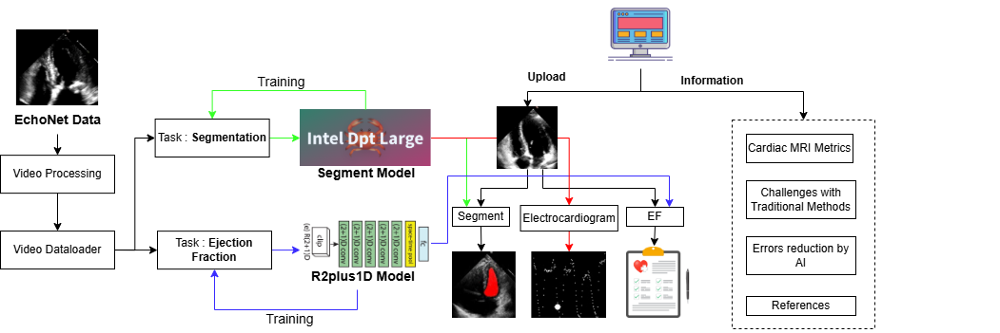

# *Team Details:*

*Team Name:* Three of Hearts

---

# *Problem Statement:*

*CardioLens* – Automated Echocardiogram Segmentation along with Report Generation Using Intel Optimized Models

---

# *Hackathon Details:*
 [*Intel® AI Hackathon @ IEEE IndiCon 2024*](http://ieeeindicon.org/)
 
Intel® AI Hackathon is an AI Readiness focused initiative for next-generation technologists from higher education institutions in India, offering them an opportunity to showcase AI innovation and impact. IEEE and IIT-Kharagpur join hands with Intel to bring this opportunity for students participating in IEEE INDICON 2024, being held at IIT-Kharagpur this year (2024).


# *Brief Overview:*

Our project focuses on leveraging the **Intel AI technologies** and Deep Learning frameworks to optimize and automate **Medical Image Segmentation** and **Ejection fraction calculation** with **Electrocardiogram** from Echocardiogram videos. By utilizing **Intel Extension for PyTorch (IPEX)**, we enhanced the performance of **PyTorch models** by running on **Intel CPUs and GPUs**, accelerating both training and inference tasks.


<p align="center">
  
</p>
The project integrates **DPT Large model by Intel, DeepLabV3 with ResNet-101, DeepLabV3 with Mobile-NetV3 Large**, for semantic segmentation of medical images, particularly **Left Ventricle Segmentation**, improving the accuracy of heart disease detection.

We used the [Echonet Dynamic Dataset](https://www.kaggle.com/datasets/snikhilrao/echonet-dynamic-data) for segmenting the Left ventricle and calculating **Ejection fraction (EF)**, which is critical in diagnosing heart conditions. The model uses a **Transformer-based architecture** (Intel-optimized) that yields high performance, including a **Dice score of 0.78**, offering reliable and timely predictions. The integration of **Hugging Face's pre-trained models** with Intel's hardware acceleration capabilities ensures optimized inference speeds.

## Project Technical Analysis Report

1. **Dataset Splitting** : The dataset contains a single folder of videos in avi format. We did the splitting of the dataset for train, test and valid.


2. **Ejection Fraction Analysis**: We know that the ejection fraction is calculated using the End diastolic and systolic volumnes. So here is the plotting which shows a good comparison between EDV and ESV. 


3. **Ejection Fraction Distribution over the dataset** : The following graph shows a typical right skewed distribution of the EF values. Values of EF have been more concentrated in between 50 and 70 percentage.

_

4. **Training Analysis** : Belows are the training results, we analyse the loss over Diastolic Frames, Systolic Frames and Over all dice score, averaging both of them
<p align="center">
  
  
  
  
</p>

5. **GPU memory usage over each model** : We did the analysis, answering the question, how much memory did each model use to train them over the same dataset? The following graph answer very neatly.


The user interface enables healthcare professionals to easily upload Echocardiogram videos, generating accurate segmentation masks and disease predictions in real-time. Through the use of *Intel AI Kits* and optimization techniques, the project addresses key challenges in manual tasks and diagnostic workflows, aiding clinicians and students in heart disease detection with AI-powered solutions.

---

# Tech Stack:

### 1. Programming Languages:

- **Python:** Used for model development, data preprocessing, and integration with AI libraries and frameworks.

### 2. *Python Libraries Used and it's case scenarios:*

- **Pytorch:** Utilized for loading and running pre-trained models, with support for deep learning operations on Intel hardware.
- **Hugging Face:** For accessing pre-trained models, including those used for image segmentation, and fine-tuning them for specific tasks. We took the Intel DPT Large Model which is pretrained on ADE Dataset.
- **IPEX:** Used for Optimized training and inference tasks, optimized for Intel architecture.
- **OpenVINO:** Used for the inference on CPU systems, and proved that OpenVINO is best performing than other two (Pytorch and IPEX optimized)
- **OpenCV:** For image loading, preprocessing and resizing in the model pipeline, particularly for medical images and video data.
- **Pandas:** For organizing and managing data, particularly the dataset with patient details and video paths.
- **NumPy:** For handling numerical data and performing mathematical operations.
- **Sci-Py:** Used for advanced signal processing operations.
- **Matplotlib:** Used for visualizing segmentation results, including masks and other outputs from model inference.
- **Seaborn:** For plotting graphs and displaying results such as performance metrics, inference times, and model accuracy
- **CUDA:** Leveraged for accelerating model training and inference on compatible *Intel GPUs*.
- **TorchVision:** For model loading, data augmentation, and utilizing pre-trained models in *PyTorch*.
- **OS (Python’s os module):** Used for organizing file paths and managing directories for storing model weights, videos, and outputs.
- **Pathlib:** For managing directories and paths in a cleaner and more structured way.

---

# What I Learned:

From this experience, I have gained in-depth knowledge of leveraging Intel Libraries, and the powerful combination of Intel hardware acceleration with Hugging Face models for optimized deep learning workflows. I was very amazed with performance of OpenVINO for inference and IPEX for training. It was nearly 50% reduced from the original traditional method.

I learned how to manage and resolve dependency conflicts while setting up essential libraries like torch, wget, and matplotlib, ensuring a robust environment for executing AI models. By utilizing Intel Extension for PyTorch (IPEX), I enhanced the performance of models running on Intel CPUs and GPUs, accelerating training and inference tasks (with OpenVINO) significantly. Handling deprecation warnings, such as replacing the pretrained parameter with weights in PyTorch, helped me stay updated with the latest framework updates and adapt the code to Intel-optimized workflows.

Working with CUDA allowed me to leverage hardware acceleration to significantly boost the speed of model training and inference, improving both efficiency and scalability.

I experimented with DPT Large model by Intel, DeepLabV3 with ResNet-101 and DeepLabV3 with Mobile-NetV3 Large into the workflow for semantic segmentation, leveraging the pre-trained model from Hugging Face to efficiently segment objects in medical imaging tasks, such as echocardiogram analysis. By fine-tuning the DeepLabV3 model on my dataset, I improved the segmentation accuracy of structures like the left ventricle. Intel’s optimizations allowed me to significantly reduce inference time while maintaining high accuracy, further enhancing the effectiveness of the solution in real-world applications.
| Type                      | DPT Model | DeepLabv3 ResNet101 | DeepLabv3 MobileNetV3 |
|---------------------------|-----------|---------------------|-----------------------|
| *Loss*                  | 0.1419    | 0.0441              | 0.053                 |
| *Overall Dice Score*    | 0.5632    | 0.9209              | 0.8836                |
| *Diastolic Dice Score*  | 0.5707    | 0.9058              | 0.8595                |
| *Systolic Dice Score*   | 0.5584    | 0.9304              | 0.89936               |
| *Time for 1 Epoch (in Sec)*      | 223.613   | 7.064               | 6.6460                |


Furthermore, I enhanced my expertise in video segmentation, CPU utilization for high-performance tasks. By managing output data such as segmentation masks and heartbeat cycle videos using Python’s os and pathlib modules, I optimized the storage of these results. This structured organization streamlined workflows, making it easier to track outputs and maintain reproducibility across experiments.

Moreover, by integrating *Hugging Face* models with Intel's hardware and software stack, I gained insights into using pre-trained models for efficient inference, ultimately enhancing model performance while using Intel’s powerful AI tools.

This project has solidified my skills in working with Intel AI solutions for efficient model inference, optimization, and deployment, while maintaining security and performance standards. It has emphasized the importance of combining cutting-edge AI libraries like Hugging Face with Intel AI Kits to achieve optimal results in domains like medical imaging, computer vision, and AI-driven diagnostics.

---
---

## Setup and Configuration for Training Models on EchoNet Dynamic Dataset (Folder : Model Training and Development)
1. *Dataset Link* : Please download the dataset from kaggle and set the dataset path accordingly. Link : https://www.kaggle.com/datasets/snikhilrao/echonet-dynamic-data

Before starting your training check whether your GPU is enabled or not ie., make sure you will get "True" for torch.cuda.is_available(), if you wish to train the model on GPU or you can continue upon CPU itself.

2. *Dataset Path :*

   Change the path to your dataset directory:
   ```
     data_dir = "...EchoNet-Dynamic-Data"
   ```
   
   Dataset structure : 
   ```
   - EchoNet-Dynamic-Data
   -- Videos
   -- VolumeTracings.csv
   -- FileList.csv
   ```

3. *Model Path :*

    For using other versions of the model, just change the path :
    
    ```
    model = DPTForSemanticSegmentation.from_pretrained("Intel/dpt-large-ade")
    ```
    If you prefer using DeepLabV3 model with ResNet101 instead of MobileNetV3, simply replace mobilenet_v3 with resnet_101 in the following line:
    
#### DeeplabV3 with MobileNetV3
```
    model = torchvision.models.segmentation.deeplabv3_mobilenet_v3_large(pretrained=True)
```
    
#### DeeplabV3 with ResNet101
```
    model = torchvision.models.segmentation.deeplabv3_resnet101(pretrained=True)
```

And change the model accordingly based on your chosen version :
    
```
    model_name = 'mobilenet_v3_large'
```

```
    output_seg = os.path.join("Models", "segmentation", "{}_{}".format(model_name, "pretrained" if pretrained else "random"))
```

4. *Output Folder Path :*

    Change the path of the output folder to your desired location:
    ```
    model_name = 'intel-dpt-large'
    output_hf_seg = os.path.join("output", "segmentation", "{}_{}".format(model_name, "pretrained" if pretrained else "random"))
    os.makedirs(output_hf_seg, exist_ok=True) 
    ```
You can select any of the above models of your choice and proceed with the instructions given.

## User Experience and Results

The user is required to upload a cardiography video by which they would get the three following results :
- Left Ventricle Segmented Mask Video overlayed on the input video for better visualization
- An electrocardiogram video to visualize the heartbeat, so that the user and any specialist can observe the heartbeat and can determine if there are any anomalies.
- Health Report based on the Ejection Fraction for cause and cure information


### Project Video Demonstrations

**Example 1 :**
<p align="center">
  
  
  
</p>

**Example 2 :**
<p align="center">
  
  
  
</p>

## Intel vs Pytorch Comparison

I have experimented with over 10 random videos from test data and here are the comparison of the results based on the inference time (in seconds). These results are produced on CPU device (Intel i7 12th Gen 12650H ~2.7GHz)


**Task 1 : Segmentation**


**Task 2 : Ejection Fraction Calculation**


## Web Interface Instructions
Here's a concise set of instructions you can include in your GitHub repository for running the website after cloning the project:
--

### How to Run the Project


1. **Set Up Frontend:**
   - Open a new terminal and navigate to the frontend directory:
     ```bash
     cd 'Web Portal'
     cd frontend
     ```
   - Install dependencies:
     ```bash
     npm install
     ```
   - Start the development server:
     ```bash
     npm start
     ```
   - The frontend should now be running on `http://localhost:3000` (or your configured port).

2. **Access the Website:**
   - Open your browser and go to `http://localhost:3000`.

---
### How to use the website

1. User selects one of the four videos, in the main page. The uploading video section is been terminated due to limitations.
2. The video gets processed and all the detailed analysis report is generated and shown in a very simple and understandable manner

**Additional Features** (Sections in sidebar):

  1. **Cardiac Metrics** : This section introduces you to the project content and describes briefly about the introduction terms.
  2. **Echo Error Prevention** : This section introduces you about the current problems faced and how this project is going to solve those problems.
  3. **Meet our Team** : This section contains details about the 3 Team members and our mentor. We are thank ful to Mr.Siva lal Sir, ECE HoD for his guidance over our project.

---
### Website preview: 

1. Video Uploading Page

<p align="center">
  
</p>

2. Results after Video Uploading

<p align="center">
  
</p>

3. Cardiac Metrics Information


<p align="center">
  
</p>

4. Problems and Errors in current real world

   
<p align="center">
  
</p>

5. Our Team
   
<p align="center">
  
</p>

**_Note_** : _Currently the user of backend has been suspended due to cost constraint. We are looking for funding to make our website fully functional.**We are currently working on the website for the uploading features and backend. We are trying to complete it by 7th December 2024.**_

**_Note_** : _The web interface part is about to be complete. The backend part is completed but we are facing in the frontend. Looking forward to solve it._


---
# Contact

**_Nikhileswara Rao Sulake_**

_nikhil01446@gmail.com_

_+91 6281128232_


